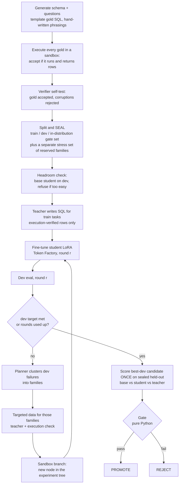
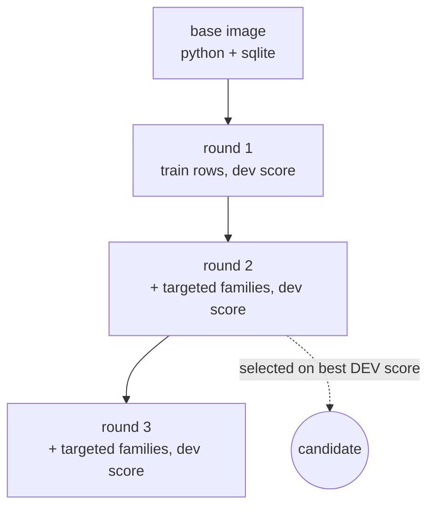

# Distillery

**Sandbox-verified distillation autopilot on Nebius Token Factory.**

Distillery turns a narrow, repetitive job that a big model does well (today: text-to-SQL over a synthetic SQLite database) into a small fine-tuned model that does it for a fraction of the cost. A planner agent (Nemotron 3 Ultra) designs the task set and reads the failures, a teacher (Nemotron 3 Super) writes training answers, a cheap triager (Nemotron 3 Nano) flags dirty output, and a small student (Qwen3-1.7B, LoRA) is fine-tuned on Token Factory. Every training example and every evaluation is verified by executing the SQL in a sandbox, and a pure-Python gate (no LLM anywhere in it) decides PROMOTE or REJECT from a sealed held-out set.

> **Status (2026-10-07): one gated run PROMOTEd on the in-distribution gate set, and it did not carry over to an independently written question set.** On the pre-registered 300-question held-out set the 1.7B student scores 92.3% vs base 25.7% and teacher 90.0% (ratio CI [0.993, 1.061], McNemar p 1.6e-57; run cost $4.26). On 86 questions written blind by a separate agent (not by a human) it scores 40.7% vs base 38.4%: **REJECT**, so the result does not generalise beyond the templated phrasing. Every number below is from a recorded run in [docs/proofs/evidence](docs/proofs/evidence); see [STATUS.md](STATUS.md).

## How it works

Each round the agent fine-tunes the student, scores it on a dev set, has the planner cluster the failures into task families, generates targeted data for those families, verifies it by execution, and branches the sandbox so every round is a node in an experiment tree. The held-out set is opened once, for the best-on-dev candidate only.



Sandbox branching is the experiment tree. Each round forks the previous round's sandbox image, so a node is a real image with a parent and a label, and the UI draws exactly that lineage joined with that round's metrics:



(Shape of the tree only. The number of rounds and which node is selected come from the run, never from this diagram.)

More detail, matched to the code: [docs/ARCHITECTURE.md](docs/ARCHITECTURE.md).

## How we use Nemotron

| Role | Model | Model ID (live-verified on `GET /v1/models`, 2026-09-30) | Job |
|---|---|---|---|
| Planner | Nemotron 3 Ultra | `nvidia/Nemotron-3-Ultra-550b-a55b` | clusters dev failures into task families to target (not used to vet gold) |
| Teacher | Nemotron 3 Super | `nvidia/nemotron-3-super-120b-a12b` | writes SQL for training tasks; scored as the ceiling on held-out |
| Triage | Nemotron 3 Nano | `nvidia/NVIDIA-Nemotron-3-Nano-30B-A3B` | advisory format check on teacher output; never drops verified rows |
| Student | Qwen3-1.7B + LoRA | `Qwen/Qwen3-1.7B` (fine-tuned on Token Factory; served on Nebius Sandbox CPU; the live spike showed it fits a 4 GB sandbox with about 93% RAM use) | the small model we are distilling into |

Roles map to IDs through `DISTILLERY_MODEL_PLANNER|TEACHER|TRIAGE|STUDENT`; nothing else in the code names a model. All three Nemotron models returned valid JSON with `response_format` `json_schema` (`strict: true`) on the first live try, and `usage` includes reasoning tokens.

## Where Token Factory accelerated us

Only things we actually observed. Anything not run yet says so.

- **Structured output (measured, live):** `json_schema` mode worked on Nano, Super and Ultra with the `{name, schema, strict}` wrapper. The planner and triager return parsed, schema-checked objects, which is what lets the orchestrator stay a plain state machine. Reasoning text comes back in a separate field (`reasoning` / `reasoning_content`) so `content` is the final answer only.
- **Fine-tuning API (run live, 3 jobs):** OpenAI-compatible files and jobs endpoints, LoRA on Qwen3-0.6B (earlier smoke runs; the gated run uses 1.7B), checkpoint download, cancel and resume-by-adoption all worked. Jobs expose resolved hyperparameters, trained tokens and per-step loss, which is how we found that the provider defaults had trained the student for only 3 to 9 steps.
- **Sandboxes (run live):** every gold, training row and evaluation is executed in a Nebius Sandbox (4 CPU, about 4 GB); 40 in parallel worked, branching produced a real experiment-tree node, and the 0.6B student plus base run on sandbox CPU (about 7.8 s per sample). Friction is logged in [FEEDBACK.md](FEEDBACK.md).
- **Friction we hit (real):** Sandboxes need a project id that the getting-started page does not mention; prices are not exposed in the API; the fine-tunable Qwen3-1.7B cannot be served serverless. Details in [FEEDBACK.md](FEEDBACK.md).

## Nebius services used

| Service | Use | Status |
|---|---|---|
| Token Factory inference (Nemotron 3 Ultra, Super, Nano) | planner, teacher, triage | live-verified for structured output and usage |
| Token Factory fine-tuning (LoRA, Qwen3-1.7B for the gated run; 0.6B in the earlier smoke runs) | train the student | live-verified (3 jobs); undertrained at provider defaults, now pinned |
| Sandboxes (Contree) | execute and verify SQL, serve base and student on CPU, branch experiments | live-verified |
| Dedicated endpoints / serverless endpoint | serve the fine-tuned student and this app | not used for the student (it runs in Sandboxes); backend deploy on Nebius pending |

Inference, fine-tuning and sandbox work run on Nebius Token Factory; the web app itself is hosted on Render (see [docs/DEPLOY.md](docs/DEPLOY.md)). The base model weights are never downloaded locally. The small LoRA adapter checkpoint that fine-tuning produces IS downloaded to the run directory (`run_dir/round*/checkpoints`) so its SHA-256 can be verified, and is then loaded inside Nebius for serving.

## Results

Measured, from recorded runs (`docs/proofs/evidence/`, claims and procedure in [DECISIONS.md](DECISIONS.md)). The student is Qwen3-1.7B (LoRA); the teacher is Nemotron 3 Super.

| Run | Set | Base | Student | Teacher | Verdict |
|---|---|---|---|---|---|
| P4 (gated) | 300 held-out, templated, in-distribution | 25.7% | 92.3% | 90.0% | **PROMOTE** (ratio CI [0.993, 1.061], McNemar p 1.6e-57, cost $4.26) |
| P4 stress | stress set (concepts outside training) | 9% | 16% | 99% | not a pass: the student does not transfer to unseen concepts |
| Gate B | 86 agent-authored natural questions | 38.4% | 40.7% | 98.8% (inflated: it drafted the gold) | **REJECT** (ratio lower bound 0.306, McNemar p 0.84) |
| B2 fair teacher | same 300 held-out | n/a | 92.3% | 93.3% (8-shot Super, strongest on dev) | no beat-the-teacher claim (ratio 0.989, CI [0.957, 1.022]) |
| A5 autonomy | fresh run under 8 injected faults | n/a | PROMOTE (ratio lower bound 1.022) | n/a | passed every check: 4 restarts, 1 adopted fine-tune job, $4.19 |

Cost per 1k tasks is not yet reported (serving path is sandbox CPU, not a priced endpoint). The "agent-authored" set was written blind to the templates by a Claude subagent and confirmed by it; it is not human-written.

`python -m distillery run ... --dry-run` prints a report that looks like this but uses fake models and fake prices; it is labelled "DRY RUN, numbers are NOT results" everywhere it appears.

## Integrity guarantees

These are enforced in code and covered by offline tests, not by convention.

- **Sealed held-out.** Only `evaluator.py` may call `Store.load_heldout` (an AST test enforces this). The held-out set is scored once, for the candidate with the best dev score, never per round.
- **In-distribution gate plus a separate stress set.** The sealed gate set (n >= 300) only contains families the student trained on; its questions and gold never appear in train or dev, and the share of gate questions that reuse a training question skeleton is measured and reported. A second sealed stress set (about 100, reserved families chosen by a fixed seeded rule) is scored separately and is never a gate input. Both seals are readable only by `evaluator.py` (AST-tested).
- **The planner never sees held-out** for failure analysis (tested). Gold is written by templates and executed; no model vets or writes it.
- **Gate rules.** PROMOTE only if the paired-bootstrap lower bound of student/teacher accuracy is at least 0.85 AND the student beats base by an exact McNemar test at alpha 0.05 (student-only wins must exceed base-only wins). Thresholds are config, not code.
- **Train prompts equal eval prompts.** One message builder (`prompts.py`) is used for training rows and evaluation.
- **Artifact identity.** The adapter that is evaluated is checked by SHA-256 against the one the fine-tune job produced; a mismatch aborts.
- **No LLM in the gate.** `gate.py` is a pure function over booleans; verification is execution match, not a judge.
- **Money.** Paid resources (fine-tune jobs, sandbox serving) are cancelled or closed in `finally` blocks on failure and normal exit, covered by tests for failed jobs, failed generation and failing `close()` (a failed close is raised loudly, since it may keep billing); runs preflight against a budget cap; live runs need an admin token and explicit approval.

## Quickstart

```bash
cp .env.example .env          # then fill in secrets; .env is gitignored
python -m venv .venv && .venv/bin/pip install -e ".[dev]" fastapi uvicorn httpx
(cd frontend && npm install)
make dev                      # backend on :8000 + Vite dev server
make test                     # backend and frontend tests, all offline
```

Try the pipeline with no network and no keys:

```bash
python -m distillery run --pack sql --scale tiny --dry-run
```

That uses FAKE models and FAKE prices and takes about 9 s. It proves the plumbing (resume, cancel-on-failure, budget refusal, sealed held-out, artifact check) and says nothing about model quality. Its output is labelled as a dry run.

## Deploy

The app is deployed as one Render web service (see [docs/DEPLOY.md](docs/DEPLOY.md) for the settings and the free-plan limits); the Docker image below is the same one. Live check: `python scripts/smoke_live.py <url>` (18/18 passed on the deployed service).

The `Dockerfile` builds the frontend, installs the backend, and serves the API plus `frontend/dist` with uvicorn on `$PORT` (default 8000) as a non-root user, with a healthcheck on `/api/health`. No secrets are baked in.

```bash
make docker                               # docker build -t distillery:local .
docker run --rm -p 8000:8000 --env-file .env distillery:local
```

Without `NEBIUS_API_KEY` the server starts in `replay-only` mode and serves the labelled sample.

- **Generic container host:** expose the container port, set `PORT` if the host injects one, mount a volume at `/data` (`DISTILLERY_HOME`) so runs survive restarts, and set the variables from `.env.example` in the host's secret store. Health check path: `/api/health`.
- **Nebius Serverless Endpoints (first target):** we have not read a verified deploy procedure for it or run one. The expected shape is: push the image to a registry Nebius can pull from, create the endpoint with container port 8000, set the same environment variables as secrets, and point the health check at `/api/health`. Check each step against Nebius's current docs before relying on it.

## Limitations

- **The win is in-distribution only.** The gated run PROMOTEd on templated questions but the student scored 40.7% vs base 38.4% on 86 independently phrased questions (REJECT) and 16% on the stress set. Next step is training on naturally phrased, teacher-verified data.
- **Student serving is slow.** Base and student run on Nebius Sandbox CPU (measured about 10 to 29 s per sample for Qwen3-1.7B depending on concurrency, 0.6B about 7.8 s; 4 CPU / 4 GB, with 1.7B using about 93% of the RAM), because neither is on the serverless inference API. Sandbox pricing is unknown, so cost per 1k tasks for the student is reported as unavailable.
- **The gate set shares question wording with training.** Phrasings are hand-written templates; most gate questions reuse a training question skeleton with different literals. The report states the measured rate; the stress set is the only unseen-structure signal.
- **Toy database.** A synthetic schema with 89 templates in 12 families. Results say little about real-world text-to-SQL.
- **Small held-out.** The full scale holds 300 items and tiny holds 20, so confidence intervals are wide; the gate accounts for this by using a lower bound, but a small win can still be REJECTed.
- **Prices are hand-copied** from the console into `DISTILLERY_PRICES_FILE`; fine-tune cost is an explicit estimate you pass in.

## License

MIT. See [LICENSE](LICENSE).
