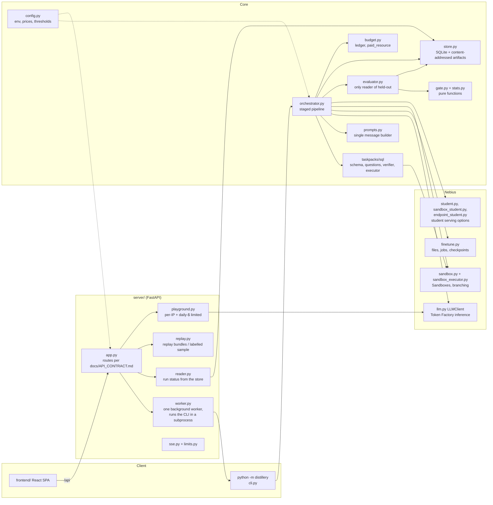
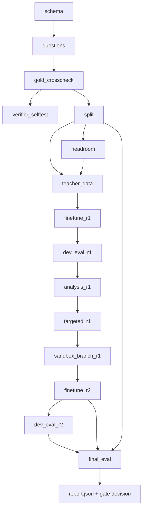
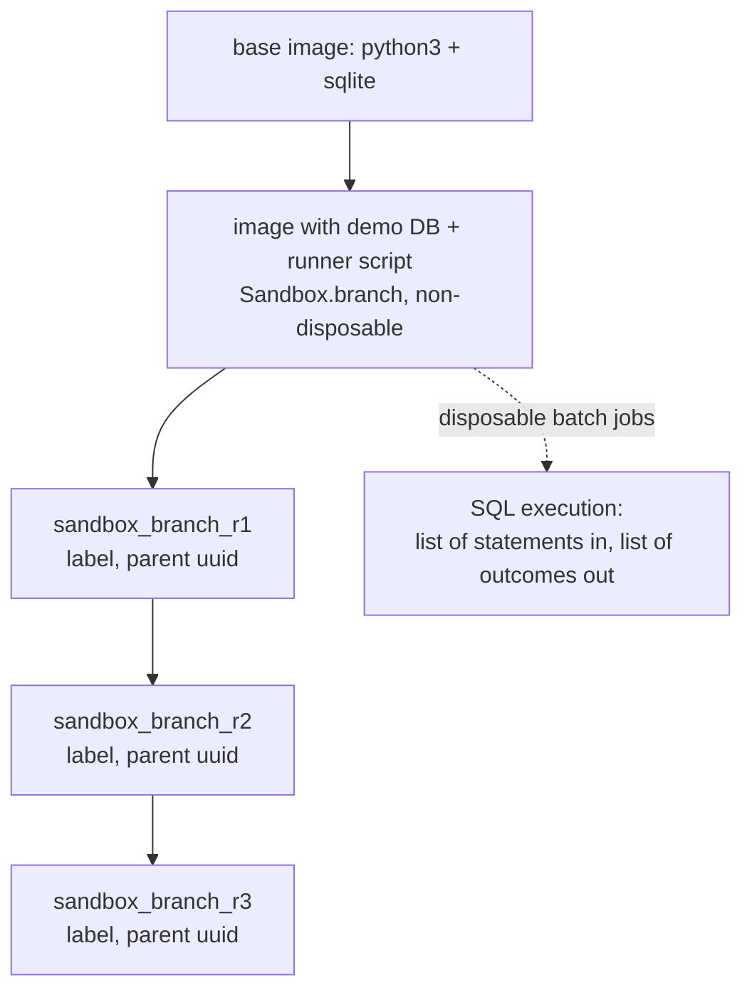
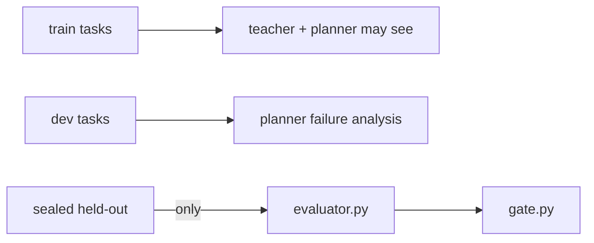

# Architecture

Describes what exists under `src/distillery` today. Statuses: "offline-tested" means unit-tested with fakes; "UNVERIFIED" means never run against the real service.

## Components

Notes tied to the code:

- The API never runs the pipeline in-process. `worker.py` starts `python -m distillery run` as a subprocess (one at a time; a second live run gets 409) and streams its output to SSE.
- `pipeline_fakes.py` holds the deterministic fakes used by `--dry-run` and tests; dry runs use a separate store root and a `dry-` run id prefix.
- Serving the student has three candidate paths (spike S4, all UNVERIFIED): sandbox CPU with peft (`sandbox_student.py`), dedicated endpoint (`endpoint_student.py`), or a serverless job (not found in docs). `student.py` holds the interface.
- `LLMClient` routes by role (planner, teacher, triage, student), classifies retries, handles `json_schema` structured output, splits reasoning from content, and logs usage into the budget ledger.

## Pipeline stages

Stage names are the ones in `orchestrator.py`; `r` is the round number. Each stage is cached in the store by input hash, so a killed run resumes.

- `split` seals the held-out set; the store refuses to hand it out except to `evaluator.py`.
- `headroom` scores the base student on dev and raises `TaskTooEasyError` if accuracy is at or above the threshold (default 0.80).
- `final_eval` evaluates only the round with the best DEV accuracy, verifies the adapter SHA-256 against the fine-tune job's, scores base, student and teacher on the same held-out items in the same order, and calls the gate.
- Later rounds repeat `analysis`, `targeted`, `sandbox_branch` and `finetune` up to `max_rounds` (default 3).

## Sandbox branching tree

`Sandbox.lineage()` returns `(uuid, parent_uuid, label)` tuples. `GET /api/runs/{id}/tree` joins that lineage with per-round metrics from the report and never invents nodes. Real Contree behaviour (branching with files, stdin, output truncation, image contents) is UNVERIFIED; the fake sandbox reproduces the lineage semantics for tests.

## Data integrity boundaries

## Deploy

One container: the API plus `frontend/dist` (see `Dockerfile`). The deploy path to Nebius Serverless Endpoints is UNVERIFIED.
